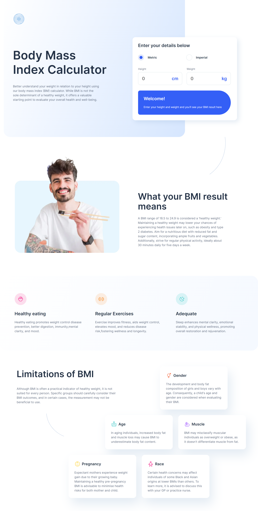

# BMI-Calculator

# Frontend Mentor - Body Mass Index Calculator solution

This is a solution to the [Body Mass Index Calculator challenge on Frontend Mentor](https://www.frontendmentor.io/challenges/body-mass-index-calculator-brrBkfSz1T). Frontend Mentor challenges help you improve your coding skills by building realistic projects.

## Table of contents

- [Overview](#overview)
  - [The challenge](#the-challenge)
  - [Screenshot](#screenshot)
  - [Links](#links)
- [My process](#my-process)
  - [Built with](#built-with)
  - [What I learned](#what-i-learned)
  - [Continued development](#continued-development)
  - [Useful resources](#useful-resources)
- [Author](#author)
- [Acknowledgments](#acknowledgments)

## Overview

### The challenge
The challenge is to build out this body mass index calculator page and get it looking as close to the design as possible.

You can use any tools you like to help you complete the challenge. So if you've got something you'd like to practice, feel free to give it a go.

Your users should be able to:

- Select whether they want to use metric or imperial units
- Enter their height and weight
- See their BMI result, with their weight classification and healthy weight range
- View the optimal layout for the interface depending on their device's screen size
- See hover and focus states for all interactive elements on the page

### Screenshot

### Links
- Solution URL: https://github.com/Dev-Kwame/BMI-Calculator
- Live Site URL: https://bodymassindexcalc.netlify.app/

## My process

### Built with

- HTML
- CSS custom properties
- Javascript
- Typescript
- CSS grid properties

### What I learned
I learned on how and when HTMLInputElement and HTMLElement is used in Typescript. Also i got to understand further how grid-template-columns and grid-template area works

### Continued development
I would like to continue my development on how grid works and gain more undestanding for any future projects

### Useful resources
https://stackoverflow.com/ - - This helped me for questions partaining grid concepts. Fellow developed shared minds on them

## Author
Github - https://github.com/Dev-Kwame

## Acknowledgments
I would like to acknowledge my fellow developers on stack overflow